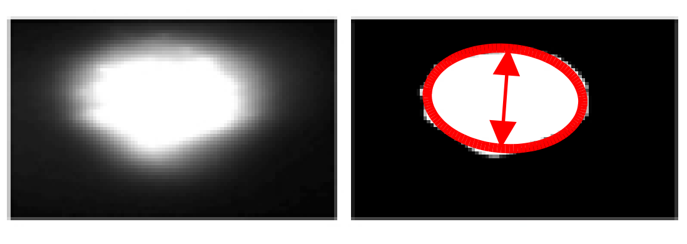
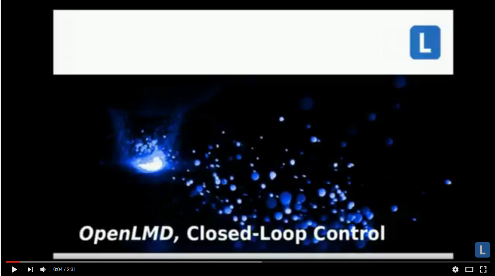
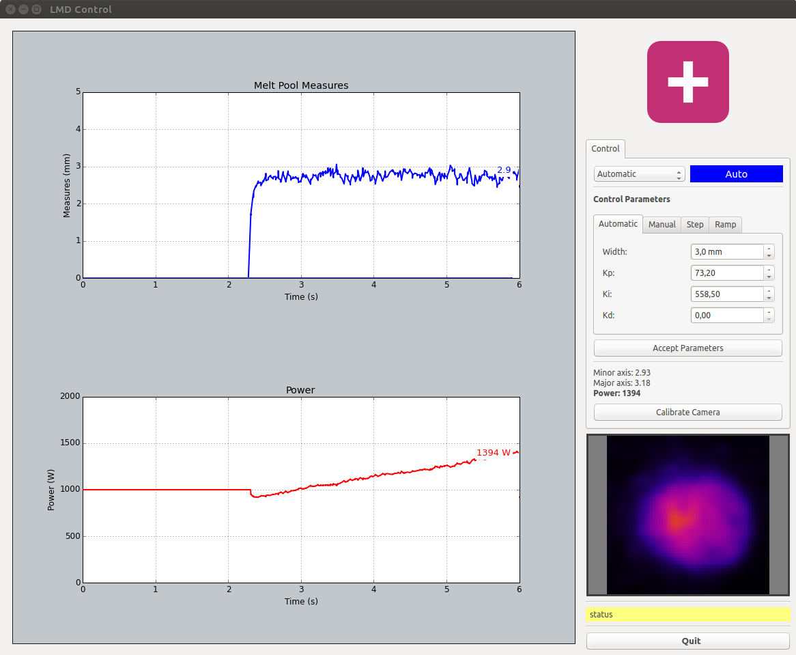
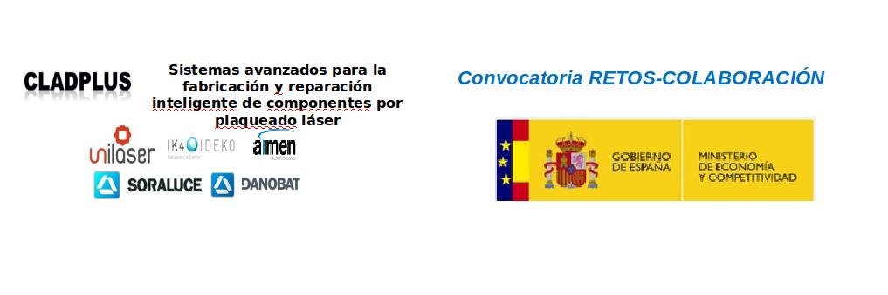

# CladPlus

Laser Metal Deposition (LMD) is a complex process, which is governed by a large
number of parameters. Among these parameters, powder flow rate, laser power,
and travel speed are typically used to control the process properties, such as
melt pool geometry, temperature, etc. Heat input control in LMD is realized by
adjusting laser power using an infrared image sensing camera as feedback. The
controller helps to overcome the effects of thermal variations and reduces
cladding geometric variations.

## Process parameters
First to designe a control system it is mandatory to have a complete knowledge of the proccess. Specifically, in this one exists a big amount of variable parameters such as laser power, powder flow, deposition velocity. In this case, the laser power has been chosen due to it affects straightly in the track width.The rest of parameters were fixed by several test.

## Control loop
The control loop is based on a PI controller. The track width is taken from the thermal camera images by image processing. Asynchronously, the control loop calculates the power necessary to reach the setpoint.



[](https://www.youtube.com/watch?v=UBkpy7_ukrA&t=46s "Video")

## Contents

This meta-package contains two packages:
- cladplus_cladviz: contains the working cell description files and the representation files.
- cladplus_control: contains the user interface and control files.

## Quick start



To record a bag file with the camera adquisition:

```shell
roslaunch cladplus_cladviz cladvid.launch
rosrun rosbag record -O control.bag /tachyon/image
```

To play a bag file with the camera registration:

```shell
roscore
rosrun rosbag play control.bag --clock
roslaunch cladplus_cladviz cladvid.launch sim:=true
```

To use simultaneously with other Openlmd projects:

```shell
roslaunch cladplus_cladviz cladvid_mashes.launch
```

```shell
roslaunch cladplus_cladviz cladvid_proper.launch
```
## Acknowledgement

